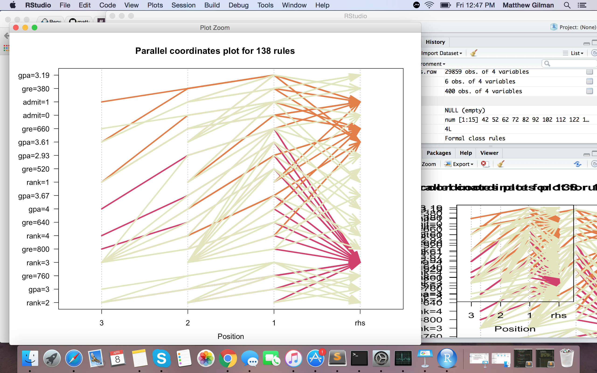
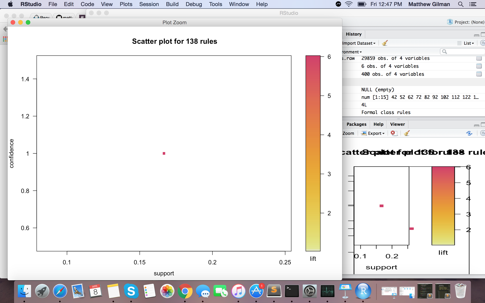
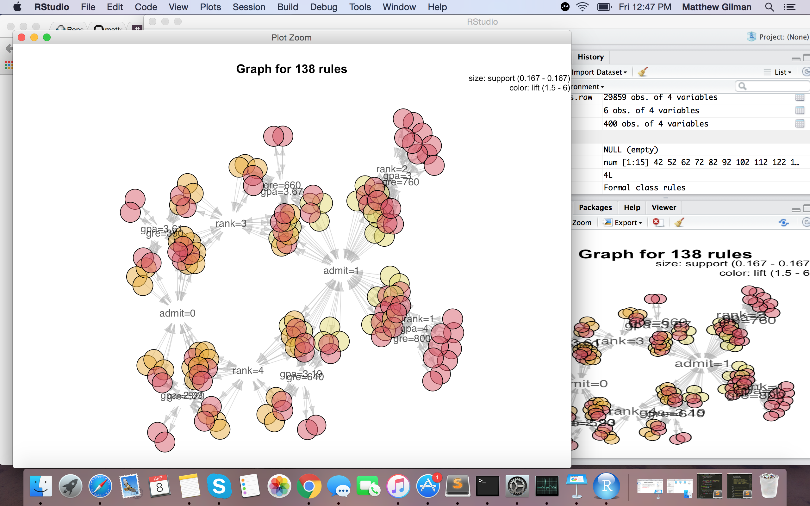

source("http://bioconductor.org/biocLite.R")
biocLite("Rgraphviz")

col_names <- head(Admissions)

library(arulesViz)

rules = apriori(col_names, parameter=list(support=0.08, confidence=0.9))
inspect(rules)

plot(rules)
plot(rules, method="graph", control=list(type="items"))
plot(rules, method="paracoord", control=list(reorder=TRUE))

I have been working with butter project. It is going slower than expected, because it has taken longer than I originally planned to figure out how it all works. They have a lot of files that are connected and a lot of different folders and files. I am / have gained a much better understanding of how it all works and have found bugs that I am fixing and figuring out how to manipulate the video app without messing anything up to the point where it won't work anymore. 
